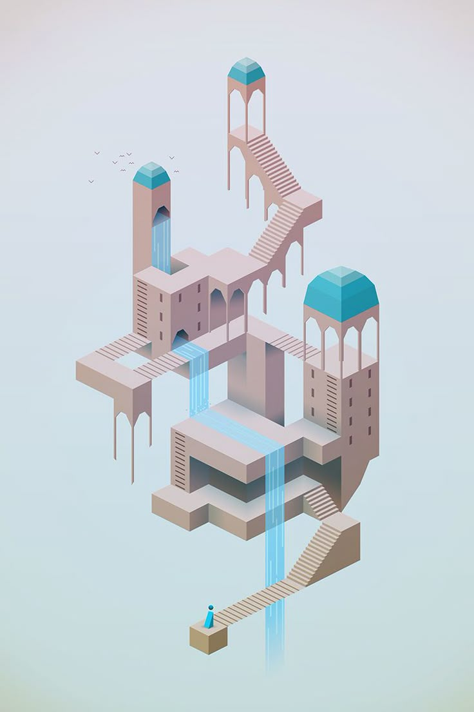
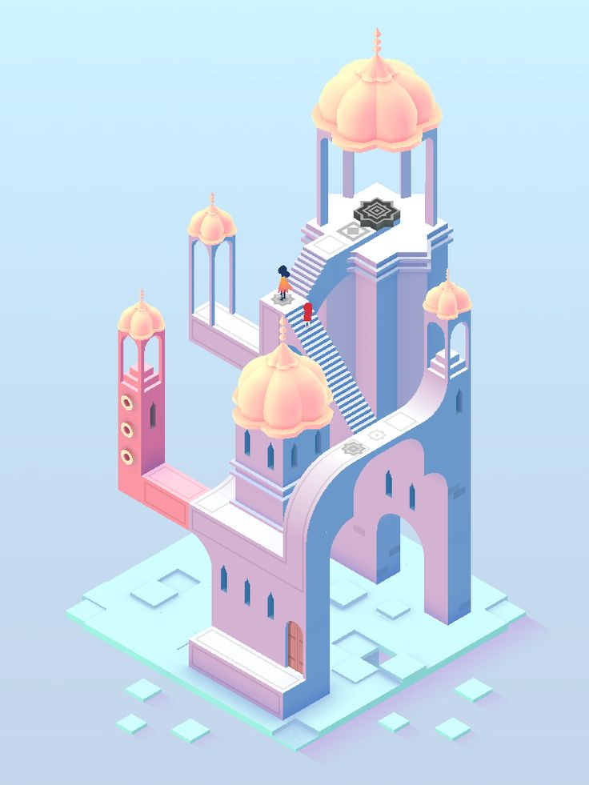
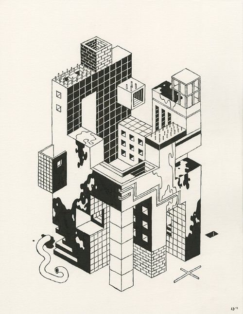

# jiyu0468_9103
##part 1
Commonly found in design projects and video games like "Monument Valley," isometric projection is one motivating imaging method.  This method allows for clear and aesthetically pleasing depictions of difficult constructions by producing a three-dimensional look on a two-dimensional plane free of perspective distortion.  I want to include isometric projection into my work to improve spatial awareness and add a contemporary, neat look.  Its capacity to show several sides of an object at once fits very nicely the emphasis of the assignment on clarity and creative graphic presentation.

##part2
I will use Three.js, a potent JavaScript tool for browser 3D graphics creation, to apply isometric projection.  Three.js offers tools to control camera angles and object positioning, so simplifying the process of rendering isometric views without directly addressing difficult WebGL code.  This library makes it possible to create interactive and dynamic isometric scenes with exact control over the visual elements so obtaining the desired three-dimensional effect smoothly inside the project.
[Link text](https://threejs.org/examples/?q=iso#webgl_geometry_text)
